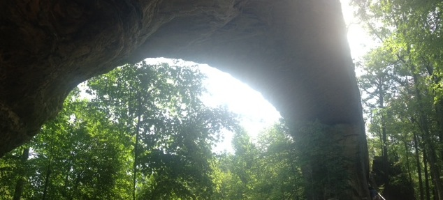

#Field Report
Paige Williams
Sand Gap Arch
October 6th, 2018

Sand Gap Arch is about 68 feet long and 25 feet tall. It is made of sandstone and sits at a high enough elevation that it offers a fantastic view of the surrounding land. The basemap I loaded into Avenza maps was very helpful in locating this feature.

  
View from beneath the arch 
  
Chestnut tree 
 
 
 
